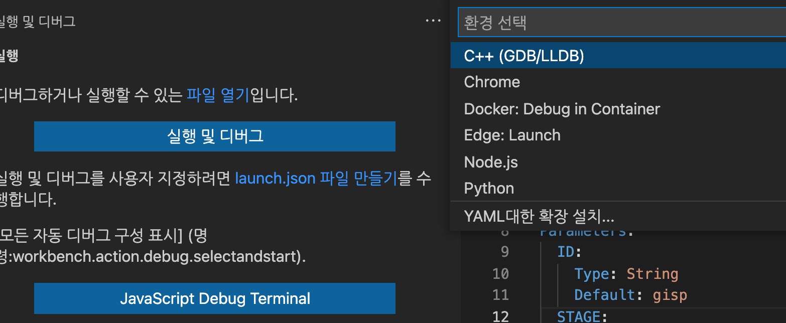
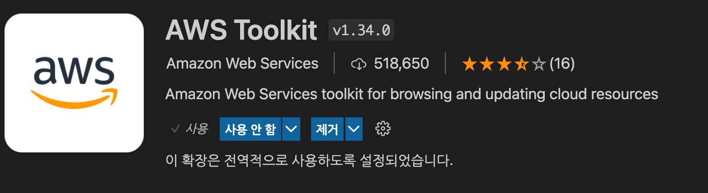
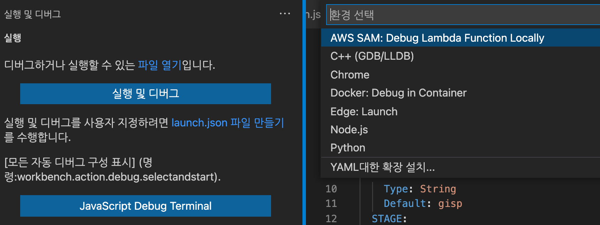
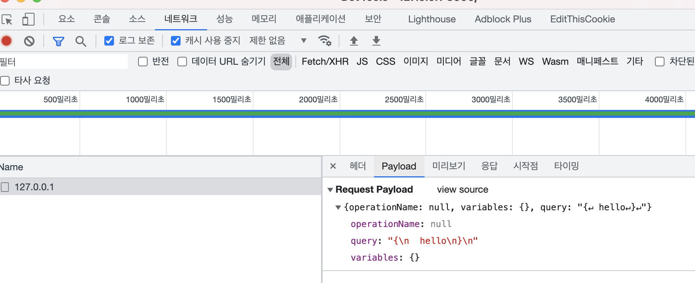
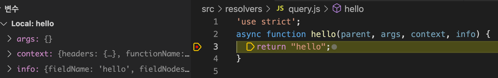
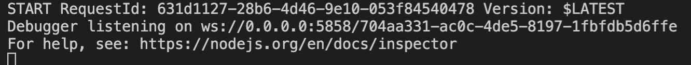
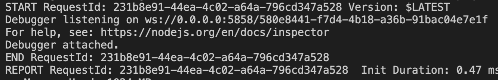

# Debugging

> 이 글은 경험에 의해 쓰여진 글이다. 어떠한 사실도 확인되지 않았음을 유의바란다.

aws sam을 통해서 로컬 테스트를 진행하면서 디버깅이 되지 않아 불변함이 많았다.

이를 해결하기 위해 시간을 들여 여러가지 실험(삽질)을 해보고 성공한 결과의 과정을 공유하려고 한다.

결론부터 말하자면 되긴하는데 좀 불편하다.

# 상황

aws lambda + graphQL

ide = vscode

aws로 프로젝트를 진행하는 것도 처음인데 graphQL이 포함되니 정보를 찾기 힘들어 시행착오가 많았다.

# 진행

특정 람다를 한번 실행시켜 디버깅하는 방법과 sam을 통해 로컬에 실행한 뒤, 디버거를 연결하는 방법으로 나뉜다.

각각 알아보자.

## 람다만 한번 실행

vscode에서 디버깅을 하려면 launch.json을 작성해야한다.

launch.json이 없으면 현재 열려있는 파일을 실행해주기는 하지만 lambda가 `호출`이 되어야 하기 때문에 launch.json 작성이 필요했다.

vscode에 디버그 탭을 보면 `launch.json 파일 만들기` 버튼이 있는데 현재 포커싱된 파일에 대한 launch.json을 생성해준다.

template.yaml 파일을 포커싱하고 `launch.json 파일 만들기`를 시도하면 다음과 같이 뜬다.



이대로는 안되고 launch.json 작성과 디버깅을 도와줄 패키지인 `AWS Toolkit`이 필요하다.



aws toolkit package를 설치하고 다시 시도 하면 아래와 같이 `AWS SAM: Debug Lambda Function Locally`라는 항목이 뜬다. 선택해주자.



./.vscode/launch.json이 생성되고 template.yaml에 적혀있는 구성요소들이 모두 디버깅할 수 있게 추가된다.

launch.json 파일에는 `configurations`에 리스트로 값이 들어가 있는데 (템플릿에 정의해둔 리소스들이다.) 이중에 invokeTarget이 api인 값이 실행하려고 하는 함수에 대한 내용이다.

다른 람다들도 동일하겠지만 graphQL람다를 실행하기 위해서는 필수적으로 api.payload.json안에 값을 넣어주어야 동작 확인이 가능하다.

graphQL의 payload는 playground에서 직접 실행해보고 크롬 개발자 도구에서 확인 가능했다.



payload작성 예시

```json
"api": {
    "path": "/",
    "httpMethod": "post",
    "payload": {
        "json": {
            "operationName": null,
            "variables": {},
            "query": "{ hello }"
        }
    }
},
```

실행을 해보자.

디버그 탭을 보면 인터페이스가 변경되어 있고 상단에 드롭다운에는 configurations 리스트에 있던 `name`들이 보인다. 이 중 payload를 작성한 항목을 찾아 선택하고 실행한다.



중단점에서 멈추고 스택과 변수들을 확인할 수 있다.

## 실행된 로컬 sam에 디버거 붙이기

> 참고: aws toolkit은 필요하지 않다.

위 방법은 매번 함수를 실행할 때마다 빌드과정을 거쳐야 하는 번거로움이 존재한다.

그 외에도 payload를 작성해줘야하는 등 불편함이 존재한다.

그래서 함수를 실행하는것이 아닌 sam local start-api에 디버거를 적용해보도록 하자.

우선 sam으로 로컬에 실행할 때 `-d <port>`옵션을 추가해 실행해보자.

예시
```shell
sam local start-api -d 5858
```

그 후, graphQL 플레이그라운드에 접속해보자.

아래와 같은 문구가 뜨면서 실행이 더이상 되지 않을 것이다.



이 때 vscode의 디버거를 해당 서버로 연결해주면 된다.

연결을 위해서 `./.vscode/launch.json`에 아래와 같이 작성하도록 하자.

```json
{
    "version": "0.2.0",
    "configurations": [
        {
            "name": "Attach to SAM Local",
            "type": "node",
            "request": "attach",
            "address": "127.0.0.1",
            "port": 5858,
            "localRoot": "${workspaceRoot}",
            "remoteRoot": "/var/task",
            "protocol": "legacy"
        }
    ]
}
```

위의 port의 5858은 sam 실행시 -d 옵션에 넣어줬던 포트값과 동일해야한다.

프로토콜이 `legacy` 인 것도 확인해야한다.

저장 후, 디버그 탭 상단에 실행버튼을 클릭하면 로컬 도커에 디버거가 연결되면서 함수가 실행된다.



작은 문제가 있는데 로컬에서는 요청이 있을 때마다 새로운 도커 컨테이너가 생성돼서 이때마다 매번 디버거 연결을 요청한다는 것이다.

게다가 플레이그라운드같은 ide에서는 내가 쿼리를 요청할 때만 요청이 가는 것이 아니라 내부적으로 한번씩 요청을 보내기 때문에 번거로움이 배가 된다.

postman같은 앱을 사용하면 추가적인 요청은 없기때문에 요청마다만 디버거를 연결해주면 된다.

아래와 같이 디버깅이 가능하다.


# 참고 자료
* aws docs
    * https://docs.aws.amazon.com/ko_kr/serverless-application-model/latest/developerguide/serverless-sam-cli-using-debugging.html
* sam local debug
    * https://stackoverflow.com/questions/47402044/visual-studio-code-debugger-not-connecting-to-sam-local