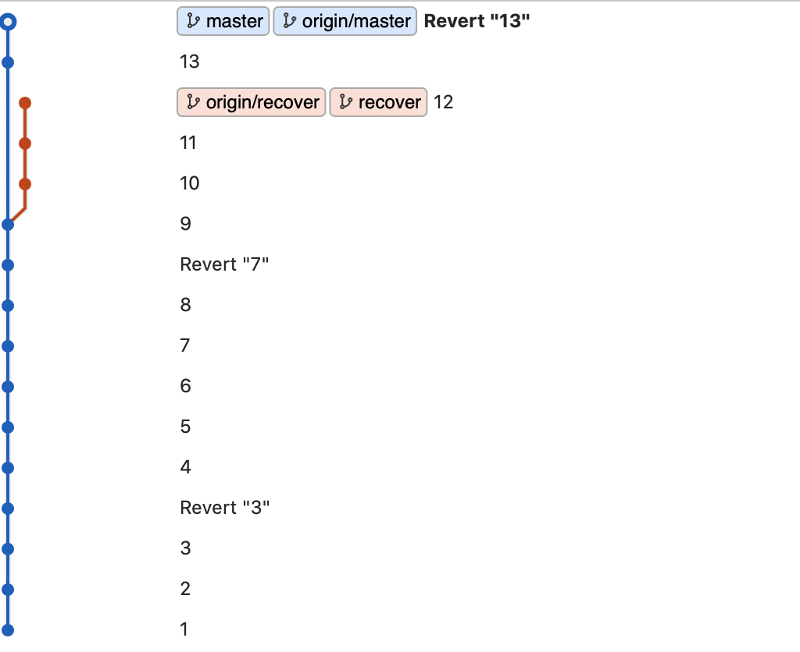

# 커밋 되돌리기
깃으로 버전관리를 하다보면 커밋을 되돌려야할 때가 있다.

이런 상황을 처리하기 위해서 깃에는 두가지 방법을 제공한다.

바로 `RESET`과 `REVERT`다.

## RESET
```git
git reset XXXXXX
```
RESET은 해당 브랜치의 위치를 XXXXXX로 되돌린다.

CHECKOUT과 같다고 생각할 수 있지만 CHECKOUT처럼 HEAD의 위치만 변경되는 것이 아니라 브랜치의 위치까지 변경된다.

브랜치 실제 위치가 변하는 것이기 때문에 해당 브랜치에서 커밋했던 이력은 되돌린만큼 사라진다.

```커밋 내용 자체는 남아있다. reflog같은 명령을 통해 실행했던 명령등을 볼 수 있고 커밋 hash값도 확인할 수 있다.```

옵션으로 --hard를 주게 되면 파일의 변경 내용도 전부 되돌려지게 되고, --soft는 변경 내용은 가진채 위치만 이동된다. --mixed는 변경 내용을 유지한채 위치를 이동하는데 스테이지에 변경사항이 올라가있는 상태가 된다.

디폴트는 --mixed로 되어있다.

## REVERT
```git
git revert XXXXXX
```
REVERT는 해당 커밋(XXXXXX)의 변경 내용을 되돌린다.

REVERT를 실행하면 변경 내용을 다시 되돌리는 커밋이 생성된다.

주의할 점은 되돌리려는 커밋의 내용이 다른 내용과 충돌이 일어날 경우 충돌처리가 필요하다는 점이다.

## 실습


- master가 3번 커밋에 있을 때, 3을 REVERT하면 3의 변경 내용을 되돌리는 커밋이 생성된다.(Revert "3")
- master가 8번 커밋에 있을 때, 8이 아닌 7을 REVERT할 수 있다. 단, 충돌이 없어야한다. 있다면 해결해야한다.
- master가 12번 커밋에 있을 때, 9로 RESET하면 해당 브랜치 내역에서는 사라진다.
- 내역에서 사라진 커밋은 실제로 사라진게 아니기 때문에 복구가 가능하다.
- 13번 커밋에서 recover브랜치를 만들고 12번 커밋으로 reset했다.

## 원격지의 브랜치의 위치 이동
```
해당 내용은 굉장히 위험한 행동이므로 정확히 이해하고 사용해야한다.
```
원격지의 브랜치의 위치를 변경하고 싶을 수 있다. 그렇다면 로컬 브랜치에서 이동한 다음 PUSH하면 된다.

하지만 기본적으로 브랜치 위치가 최신이 아니면 최신상태에서 PUSH하라고 하며 실패할 것이다.

-f --force옵션을 주면 이를 무시하고 PUSH한다.
```git
git push -f
```

# 결론
RESET은 브랜치를 깔끔하게 정리하고 간편하게 사용할 수 있지만 협업이 이루어지는 과정에서 서로의 브랜치 위치가 맞지 않아 꼬이는 상황을 초래할 수 있다. 그리고 내역이 관리되지 않는다는 점도 단점이 될 수 있다.

기본적으로는 REVERT를 사용하고 상황을 고려해서 RESET의 사용을 결정하는 것이 좋겠다.

# 참고 자료
- git 실습
    - https://learngitbranching.js.org/?locale=ko
    - https://github.com/jandy14/TEST-resetrevert
- 원격지 브랜치 되돌리기
    - https://jupiny.com/2019/03/19/revert-commits-in-remote-repository/