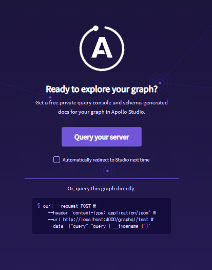
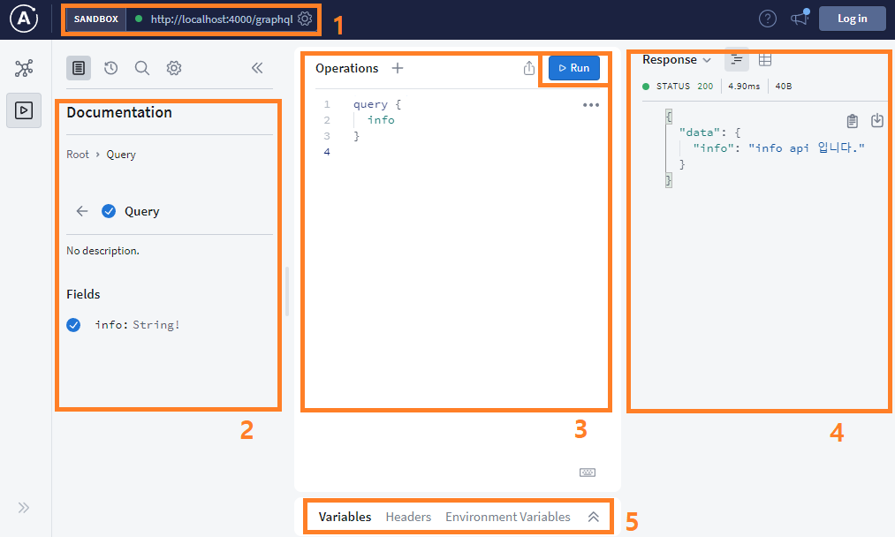

# GraphQL 시작하기
이 글은 GraphQL을 체험해보기 위한 분들을 위한 글이며 아래와 같은 내용을 포함하고 있다.

1. 시작하기
    - GraphQL에 대한 간단한 개요
    - 실습 환경 세팅
2. 실습하기
    - GraphQL의 요소
    - GraphQL을 이용한 api 작성 및 실습
        - 내용 조회하기
        - 내용 생성 및 수정

본 실습은 https://www.howtographql.com/graphql-js/0-introduction/ 을 기반으로 작성되었다.

# 개요
GraphQL(이하 gql)은 페이스북(meta)에서 개발한  프론트와 서버(백엔드)간에 사용되는 쿼리언어다.

gql은 다음과 같은 특징이 있다.

- 요청을 request body를 통해 쿼리로 하기때문에 하나의 엔드포인트로 모든 요청을 받는다. 또한 하나의 요청에 여러 쿼리를 보낼 수 있다.(단, 조회와 수정을 동시에 할 순 없다.)
- 전달받은 객체에서 필요한 필드만 선택해서 받을 수 있다.

위 특징으로 인해 다음과 같은 이점을 얻을 수 있다.

- API콜을 줄일 수 있으며, 반환하는 필드를 프론트에서 필요한 값만 요청하기 때문에 REST에 비해서 트래픽을 줄일 수 있다.
- 같은 내용을 다른 형태로 반환하는 API를 여러번 만들 필요가 없다.

단점도 물론 존재한다.

- 프론트에서 요청한대로 반환하기 때문에 요청에 대한 제약이 없으면 성능이슈로 이어질 수 있다.
- 구조상의 문제로 `N+1 문제`라는 것이 존재한다.

# 실습 환경 세팅

## Node.js 설치
각 운영체제에 맞은 node를 설치하면 된다.

https://nodejs.org/ko/download/

설치 확인은 아래 커맨드로 가능하다.

```
npm -v
node -v
```

필자는 `node v14.15.3`, `npm 8.1.0`에서 실습했다.

## Node.js 프로젝트 세팅
우선 작업을 진행할 디렉토리를 생성하고 프로젝트 초기 세팅을 해준다.
```
mkdir hello-node-graphql
cd hello-node-graphql
npm init -y
```
현재 디렉토리(hello-node-graphql)에 package.json이 생성된다.

그리고 필요한 패키지를 설치한다.
```
npm install apollo-server@^2 graphql
```

apollo-server는 gql이 구현된 서버다. express나 aws 람다용으로 구현된 것도 있다.

주의: `apollo-server` 뒤에 붙은 `@^2`는 패키지의 메이저 버전을 명시하는 것이며, 참고한 자료가 2버전을 기준으로 작성되어서 본 실습에서도 이를 따른다. (현재는 3버전이 메이저 버전이며, 약간의 기능차이가 있지만 이번 실습에서는 어느 버전이여도 상관없다.)

2버전에서 실습이 안되면 3버전으로 진행하길 바란다.

설치가 끝나면 `package.json`에 dependencies항목에 프로젝트에 설치된 항목이 추가되며 `node_modules`라는 디렉토리에 실제 패지키를 확인할 수 있다.

해당 package.json을 복사해 다른 곳에 생성한 후 `npm install` 명령을 실행하면 필요한 패키지 설치를 한번에 할 수 있다.

## gql 서버 실행

`src` 디렉토리를 생성하고 그 안에 `index.js` 파일을 생성한다.

아래 내용을 `index.js`에 넣어준다.

```
const { ApolloServer } = require('apollo-server');

// 1
const typeDefs = `
  type Query {
    info: String!
  }
`

// 2
const resolvers = {
  Query: {
    info: () => `info api 입니다.`
  }
}

// 3
const server = new ApolloServer({
  typeDefs,
  resolvers,
})

server
  .listen()
  .then(({ url }) =>
    console.log(`Server is running on ${url}`)
  );
```

설명은 뒤에 다루도록 하고 우선은 실행을 시켜보자

```
node src/index.js
```

아래 문구가 뜨면 gql 서버 실행 성공이다.
```
Server is running on http://localhost:4000/
```
url로 접근하면 아래와 같은 화면이 뜬다.



Query your server를 눌러 이동하면 gql 서버에 요청을 보낼 수 있는 페이지로 이동한다.



1. 접속할 서버
2. 서버에서 제공하는 스키마 목록
3. 요청 쿼리 작성
4. 응답
5. 파라미터, 헤더 설정

3번 칸에 `query { info }` 를 작성하고 `Run`버튼을 누르면

4번 칸에 응답이 오는 것을 확인할 수 있다.

# 정리
이번 장에는 환경을 설정하고 gql이 구현된 서버인 apollo를 실행하고 간단히 쿼리를 날려 보았다.

다음장에는 이번장에 적은 코드에 각 요소가 무엇을 의미하는지 알아보고 새로운 요청들을 작성해 보도록 하자.

# 참고 자료
- how to graphql
    - https://www.howtographql.com/